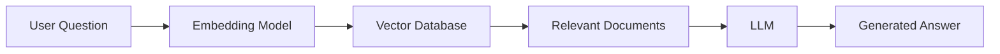

# Day 1 - Embedding Models vs Large Language Models

## What is an Embedding Model?

An embedding model converts text into a dense vector of floating-point numbers.

Example:

Input:

"I love Artificial Intelligence"

↓

Output:

[0.12, -0.56, 0.98, ...]

These vectors capture semantic meaning.

Texts with similar meanings have vectors close together.

---

## What is an LLM?

A Large Language Model predicts the next token.

Example:

Prompt:

"The capital of France is"

↓

Output:

"Paris"

LLMs generate text.

Embedding models generate vectors.

---

## Difference

| Feature | Embedding Model | LLM |
|----------|----------------|-----|
| Output | Vector | Text |
| Used For | Search | Chat |
| Training | Contrastive | Next Token Prediction |
| Memory | No | Context Window |
| Speed | Fast | Slower |
| Cost | Cheap | Expensive |

---

## Where Embeddings Are Used

- RAG
- Semantic Search
- Recommendation Systems
- Clustering
- Similarity Search
- Vector Databases

---

## Where LLMs Are Used

- Chatbots
- Coding Assistant
- Email Writing
- Agents
- Summarization
- Translation

---

## Real Example

User asks:

"Show me AI internship projects."

Embedding model finds similar documents.

LLM reads those documents.

LLM generates the final answer.

This is Retrieval Augmented Generation (RAG).

